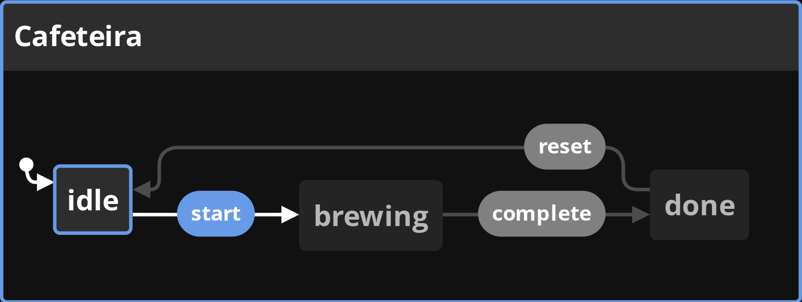
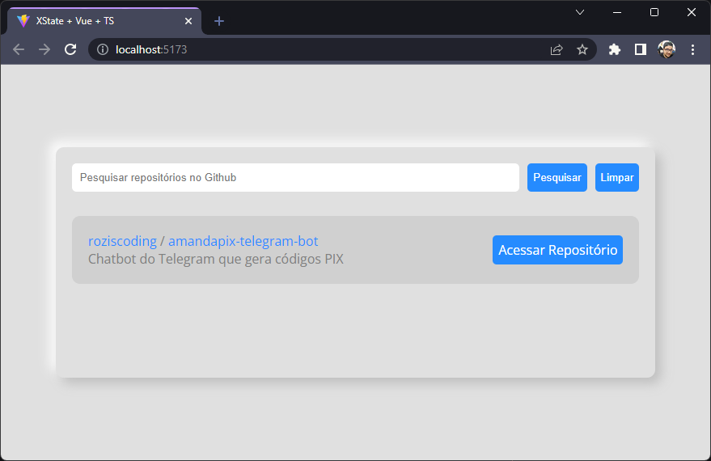
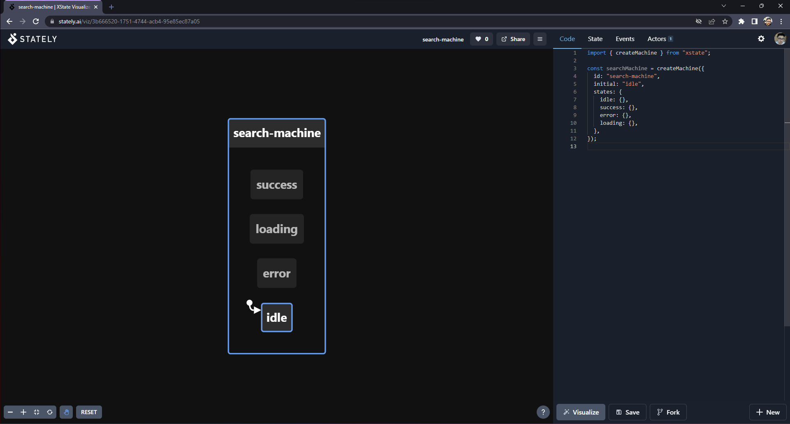
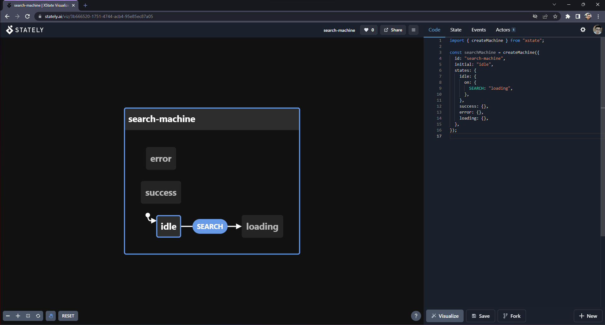
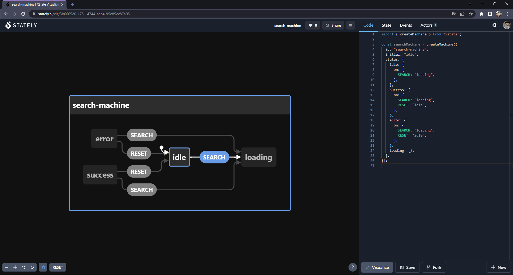
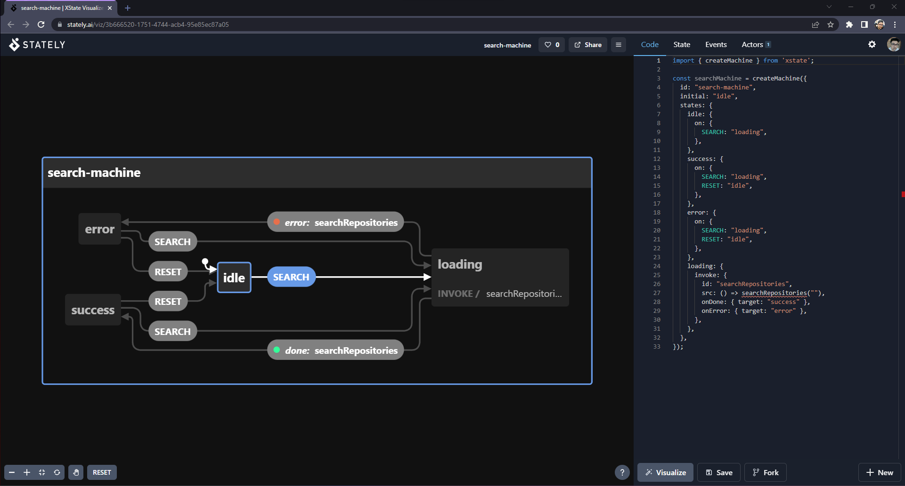
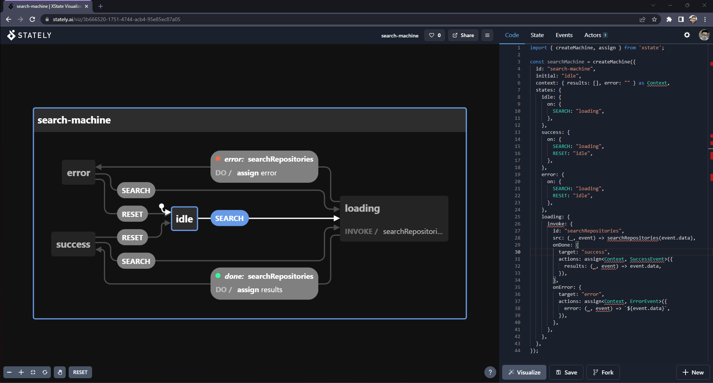
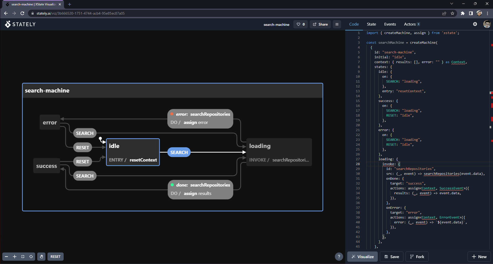
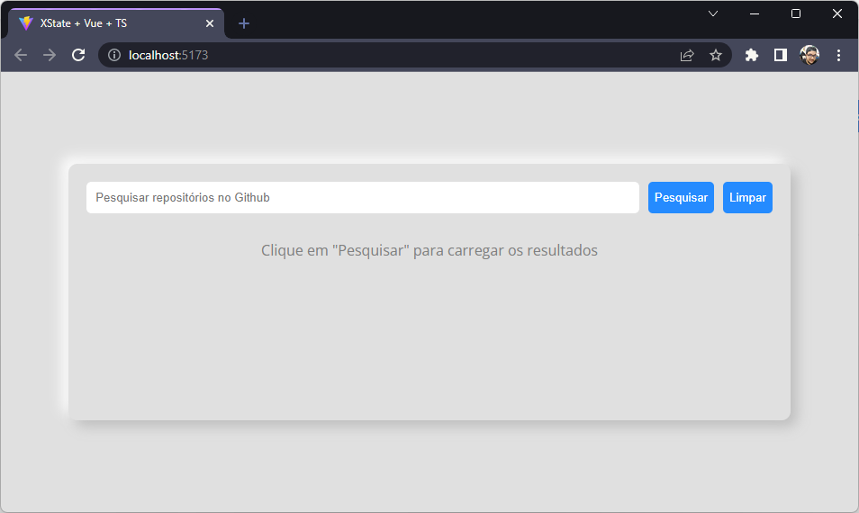

Se você já criou algumas aplicações com Vue.js, muito possivelmente já passou por dificuldades ao gerenciar o estado de um procedimento e, principalmente, ao renderizar layout específico para cada estado. Muitas vezes é preciso controlar múltiplas variáveis, como `isLoading` e `hasError`, e combiná-las em expressões condicionais como `!isLoading && hasError`, ou ainda `!isLoading && !hasError && !hasResults`. **Máquinas de estado**, ou `state machines`, oferecem uma forma mais estruturada de descrever esses estados. 

O **XState** é uma biblioteca popular para o gerenciamento de máquinas e diagramas de estado em JavaScript e TypeScrtipt que permite identificar e controlar o estado de uma máquina, bem como quais ações devem ser tomadas ao entrar e sair de cada estado, ou até mesmo depois de um determinado tempo em um estado específico. Além disso, a biblioteca também é capaz de gerar diagramas de estado baseado nas máquinas de estado descritas em código, facilitando a documentação de processos mais complexos.

Ao utilizar o XState no front-end, podemos claramente definir quais são os estados em que uma aplicação, componente ou chamada pode estar e as transições entre os estados, utilizando essa informação para atualizar o layout. Isso pode tornar a aplicação mais fácil de ler, testar e documentar. Neste artigo, vamos explorar o uso do **XState** para manter o estado de uma operação e refletir esse estado no layout de uma aplicação Vue.js.

Vamos começar explorando máquinas e diagramas de estado, e depois, vamos implementar a biblioteca para acompanhar o estado de uma requisição HTTP. Ao final deste artigo, você terá uma ideia nítida do que é o XState, como ele funciona, e como implementar state machines na sua aplicação.

## Máquinas e Diagramas de Estado

[**Máquinas de estado**](https://pt.wikipedia.org/wiki/M%C3%A1quina_de_estados_finita) são modelos matemáticos usados para descrever o comportamento de um sistema através de definição de um conjunto de estados, transições entre esses estados, e ações a serem tomadas quando essas transições são executadas, permitindo a descrição nítida e concisa de sistemas complexos e seus comportamentos. **Diagramas de estado** são representações gráficas de uma máquina de estado.

Numa máquina de estado, o sistema sempre estará em um dos estados previamente definidos, e as transições entre eles são acionadas através de eventos o condições.

Por exemplo, uma máquina de estado que descreve o comportamento de uma cafeteira poderia ter os estados "idle", "brewing", e "done" para representar a máquina quando ela estiver, respectivamente, parada, passando o café, e com o café pronto.

Além disso, poderíamos ter transições como "start", "complete" e "reset" para, respectivamente, iniciar a passagem do café, terminar a passagem café e voltar a máquina para o seu estado inicial, pronta para passar o café novamente.

Um diagrama para a máquina de estado que acabamos de descrever poderia ser montado da seguinte forma:



## Preparando o projeto

Para este exemplo, vamos utilizar uma aplicação que busca repositórios no GitHub e os exibe em uma lista. A API do GitHub é pública, e o endpoint de pesquisa de repositórios não exige autenticação.

Antes de começar a utilizar o XState, obtenha o código base do projeto no [repositório do GitHub](https://github.com/roziscoding/xstate-vue-sample/tree/layout) executando `git clone --branch layout git@github.com:roziscoding/xstate-vue-sample.git`, ou baixando e extraindo o arquivo Zip diretamente do GitHub. 

> Garanta que você está utilizando a branch `layout`, já que a branch `main` contém o projeto já finalizado.

O código base contém o layout e estilo que vamos precisar, e um arquivo utilitário que chama a API do GitHub. Esta é a aplicação que vamos criar:



O conteúdo dos arquivos de base não é o foco deste artigo e, por isso, não vou explicar o que cada arquivo faz. Se preferir, gaste um tempo lendo os arquivos do repositório antes de prosseguir.

## Implementando a máquina de estado

Antes de começar a implementação, precisamos instalar o XState e sua biblioteca de utilidade para Vue. Para isso, execute o comando abaixo na pasta do projeto:

`npm i xstate @xstate/vue`

Agora, o primeiro passo para criarmos nossa máquina de estado é mapear quais são seus possíveis estados. No nosso caso, estamos falando de uma requisição HTTP. De cara, já temos três status possíveis: carregando, sucesso, e erro. Para cada um deles daremos o nome, respectivamente, de `loading`, `success` e `error`. Além disso, teremos um estado para indicar que nenhuma pesquisa foi realizada, que chamaremos de `idle`.

Com nossos estados mapeados, chegou a hora de começar a implementar a máquina de estados. Para isso, faremos uso da função `createMachine`, exportada pelo XState.

Na tag `<script>` do arquivo `App.vue`, adicione o código a seguir:

```typescript
// App.vue > <script>
// ...
import { createMachine } from "xstate";


const searchMachine = createMachine({
  id: "search-machine",
});
```

O que esse trecho de código faz é criar uma nova máquina de estado do XState e dar a ela o id `search-machine`. O id de uma máquina do XState deve ser único para cada máquina, e é usado internamente pela biblioteca, e também ao gerar os diagramas de estado.

Agora, vamos adicionar a essa máquina os estados que mapeamos acima. Para isso, utilizamos a propriedade `states`, que é um objeto onde cada chave representa o nome de um estado. Vamos também definir, através da propriedade `initial`, que o estado inicial da máquina de estados é `idle`. O código fica assim:

```typescript
// App.vue
// ...
const searchMachine = createMachine({
  id: "search-machine",
  initial: "idle",
  states: {
    idle: {},
    success: {},
    error: {},
    loading: {},
  },
});
```

Repare que o valor de cada estado é, por enquanto, um objeto vazio. Preencheremos esse objeto com as ações e transições de cada estado mais à frente.

Nesse ponto, já podemos gerar um diagrama de estado para nossa máquina. Para fazer isso, basta acessar o [visualizador online](https://stately.ai/viz) do XState, copiar o trecho de código que cria a máquina de estado, colar no editor ao lado direito da página e clicar no botão "Visualize". O resultado será algo muito parecido com a seguinte imagem:



Por enquanto, o diagrama não é muito útil pois apenas lista os estados possíveis. No entanto, a grande sacada das máquinas de estado não está nos estados por si só, mas sim na interação entre cada estado, ou melhor dizendo, nas **transições** entre um estado e outro. Sendo assim, vamos definir quais são essas transições.

## Implementando as transições de estado

Transições são eventos que, quando disparados, alteram o estado da máquina. Precisamos definir, para cada estado, quais são as transições possíveis e em qual estado cada transição coloca nossa máquina. Para isso, vamos utilizar os objetos de cada estado dentro da propriedade `states` que estavam vazios até agora mas, primeiro, precisamos mapear essas transições.

Vamos realizar esse mapeamento para cada estado, começando pelo estado `idle`. Este estado significa que nenhuma pesquisa foi realizada. Com isso, não é possível fazer nenhuma outra ação, a não ser de fato executar a pesquisa. Quando executada, a pesquisa faz com que a requisição HTTP seja executada, o que é representado em nossa máquina através do estado `loading`. Ou seja, temos aqui nossa primeira transição, que leva a máquina do estado `idle` para o estado `loading`. Vamos chamar essa transição de `SEARCH`, dado o contexto em que ela está inserida. Para dizer ao XState que temos uma transição, basta adicionar a propriedade `on` ao objeto do estado de origem e, à essa propriedade, atribuir um objeto onde a chave é o nome da transição e o valor é o resultado de destino, assim:

```typescript
// App.vue
// ...
const searchMachine = createMachine({
  id: "search-machine",
  initial: "idle",
  states: {
    idle: {
      on: {
        SEARCH: "loading",
      },
    },
    success: {},
    error: {},
    loading: {},
  },
});
```

Agora, se atualizarmos nosso diagrama de estado, veremos que ele mostra uma possível transição do estado `idle` para o estado `loading`, chamada `SEARCH`:



Ótimo! Vamos continuar. O próximo estado é o estado `success`, que indica que a requisição aconteceu e obteve sucesso. Após executar uma pesquisa, uma pessoa que utiliza nossa aplicação tem duas opções: executar uma nova pesquisa, ou limpar o campo de pesquisa e os resultados. Sendo assim, temos novamente uma transição chamada `SEARCH`, que leva a máquina de volta para o estado `loading`, e uma transição `RESET`, que leva a máquina para o estado `idle`:

```typescript
// App.vue
// ...
const searchMachine = createMachine({
  id: "search-machine",
  initial: "idle",
  states: {
    idle: {
      on: {
        SEARCH: "loading",
      },
    },
    success: {
      on: {
        SEARCH: "loading", // Transição SEARCH, que resulta no estado "loading"
        RESET: "idle", // Transição RESET, que resulta no estado "idle"
      },
    },
    error: {},
    loading: {},
  },
});
```

Agora, temos o estado `error`. Da mesma forma que `success`, existem duas ações possíveis quando a máquina se encontra nesse estado: realizar uma nova busca, ou limpar a busca atual e, consequentemente, o erro que ocorreu ao realizá-la. Sendo assim, temos as mesmas transições para `error` e `success`:

```typescript
// App.vue
// ...
const searchMachine = createMachine({
  id: "search-machine",
  initial: "idle",
  states: {
    idle: {
      on: {
        SEARCH: "loading",
      },
    },
    success: {
      on: {
        SEARCH: "loading", // Transição SEARCH, que resulta no estado "loading"
        RESET: "idle", // Transição RESET, que resulta no estado "idle"
      },
    },
    error: {
      on: {
        SEARCH: "loading",
        RESET: "idle",
      },
    },
    loading: {},
  },
});
```

Se atualizarmos nosso diagrama, teremos agora o seguinte resultado:



O diagrama mostra exatamente o que acabamos de descrever no código: a máquina inicia no estado `idle`, e dele é possível ir para `loading`. Também mostra a existência dos estados `error` e `success`, a partir dos quais é possível ir para `idle` ou `loading`.

Por último, temos o estado `loading`. Este estado é diferente dos demais, pois é nele que nossas requisição será realizada. Apesar de ser possível a partir dele ir para os estados `error` ou `success`, não precisamos especificar essas transições manualmente, pois utilizaremos o conceito de **Serviços** para realizar a requisição e definir as transições deste estado.

## Utilizando serviços

Serviço é o conceito utilizado pelo XState para realizar ações externas à nossa máquina da qual o estado dela depende. Através da propriedade `invoke` de cada estado, podemos dizer para o XState qual serviço chamar durante aquele estado, bem como o que fazer com o resultado dessa chamada. Um serviço pode ser, dentre [outras coisas](https://xstate.js.org/docs/guides/communication.html#the-invoke-property), uma função que retorna uma Promise. Ao especificar um serviço a ser invocado, também podemos especificar transições e ações a serem tomadas em caso de erro ou em caso de sucesso.

Vamos adicionar ao estado `loading` a chamada para a função `searchRepositories`, exportada pelo arquivo `github.ts`. Para isso, adicionamos a propriedade `invoke`, que especifica qual o ID do serviço sendo chamado, bem como qual a função a ser executada. Além disso, especificaremos também qual o estado de destino em caso de erro, e em caso de sucesso

```typescript
// App.vue
// ...
import { searchRepositories } from "./github";

const searchMachine = createMachine({
  id: "search-machine",
  initial: "idle",
  states: {
	// ...
    loading: {
      invoke: {
        id: "searchRepositories", // ID do serviço
        src: () => searchRepositories(""), // Função a ser executada
        onDone: { target: "success" }, // Estado em caso de sucesso
        onError: { target: "error" }, // Estado em caso de erro
      },
    },
  },
});
```

E pronto! Se atualizarmos nosso diagrama agora, veremos o serviço e as novas transições representadas de forma correta:



Pronto! Temos todos os nossos estados e transições mapeados, e nossa máquina de estados representa o processo básico da requisição de busca no GitHub. No entanto, note que a função `searchRepository` requer um parâmetro, que é o termo de busca a ser utilizado. Para conseguirmos passar esse parâmetro, precisamos alterar a função `src` para utilizar o parâmetro `event`, que contém informações sobre o evento disparado e que levou a máquina ao estado atual. Dentre essas informações está o parâmetro `data`. O XState fornece essa informação como o segundo parâmetro da função `src`:

```typescript
// App.vue
// ...
const searchMachine = createMachine({
	// ...
    loading: {
      invoke: {
        // ...
        src: (_, event) => searchRepositories(event.data),
        // ...
      },
    },
  },
});
```

> Nota: O código acima tem um pequeno problema: se você verificar o tipo da propriedade `event.data`, verá que ele é `any`. O XState nos fornece [mecanismos](https://xstate.js.org/docs/guides/typescript.html) para tipar melhor nossa máquina de estados. No entanto, esse melhoria torna o código mais complexo e, por isso, decidi tratar especificamente disso num artigo futuro.

Agora, sim, é possível passar o termo de busca como parâmetro para nosso serviço. O próximo passo, no entanto, é obter corretamente o resultado da operação, seja ele sucesso ou erro. Para isso utilizaremos dois novos conceitos do XState: **Contexto** e **Ações**.

## Adicionando contexto e ações

O contexto, definido no XState através da propriedade `context` do objeto de configuração, é onde podemos armazenas informações pertinentes ao momento atual da nossa máquina de estado. No nosso caso, ele será útil para armazenar os resultados de uma busca, ou o erro que aconteceu ao executar uma requisição.

Enquanto serviços referem-se a ações executadas externamente à máquina de estado, as ações definidas pelo XState tratam-se de ações que acontecem puramente dentro da máquina de estado. Elas envolvem enviar um novo evento ou modificar o contexto, dentre [outras opções](https://xstate.js.org/docs/guides/actions.html). Para facilitar nossa vida, o XState nos fornece a função [`assign`](https://xstate.js.org/docs/guides/context.html#assign-action), que cria um objeto descrevendo uma ação que modifica o contexto.

Vamos começar definindo o contexto inicial da nossa máquina de estados, que terá uma propriedade chamada `results` e outra chamada `error`:

```typescript
// App.vue
// ...
import { searchRepositories, Repository, DoneInvokeEvent } from "./github"; // Adicione `Repository` ao export existente

// ...
type Context = {
  results: Repository[];
  error: string;
};

const searchMachine = createMachine({
  id: "search-machine",
  initial: "idle",
  context: { results: [], error: "" } as Context,
  // ...
});
```

Agora, podemos utilizar a função `assign` para alterar as propriedades das transições `onDone` e `onError` da chamada de serviço do estado `loading` para que eles atribuam o valor de `results` ou de `error`, respectivamente. Para isso, precisamos declarar os tipos de eventos em caso de sucesso e em caso de erro. Podemos declarar esses tipos importando o tipo genérico `DoneInvokeEvent` do XState e passando, como parâmetro de tipo, o tipo dos dados em caso de erro e em caso de sucesso:

```typescript
// App.vue
// ...
// Adicione `DoneInvokeEvent` ao export existente
import { searchRepositories, Repository, DoneInvokeEvent } from "./github";
// ...

type SuccessEvent = DoneInvokeEvent<Repository[]>;
type ErrorEvent = DoneInvokeEvent<Error>;
// ...
```

Agora, utilizamos esses tipos nas propriedades `onDone` e `onError` para adicionar uma nova propriedade chamada `actions`, que chama a função `assign` passando como parâmetro de tipo o tipo do contexto e o tipo de sucesso e de erro, respectivamente:

``` typescript
// App.vue
// ...
onDone: {
  target: "success",
  actions: assign<Context, SuccessEvent>({
    results: (_, event) => event.data,
  }),
},
onError: {
  target: "error",
  actions: assign<Context, ErrorEvent>({
    error: (_, event) => `${event.data}`,
  }),
},
```

E, com isso, temos uma máquina de estado que já é capaz de buscar repositórios na API do GitHub e armazenar os resultados ou uma mensagem de erro. Até agora, nosso código está assim:

```typescript
// App.vue
// ...
import { createMachine, assign, DoneInvokeEvent } from "xstate";
import { searchRepositories, Repository } from "./github";

type Context = {
  results: Repository[];
  error: string;
};

type SuccessEvent = DoneInvokeEvent<Repository[]>;
type ErrorEvent = DoneInvokeEvent<Error>;

const searchMachine = createMachine({
  id: "search-machine",
  initial: "idle",
  context: { results: [], error: "" } as Context,
  states: {
    idle: {
      on: {
        SEARCH: "loading",
      },
    },
    success: {
      on: {
        SEARCH: "loading",
        RESET: "idle",
      },
    },
    error: {
      on: {
        SEARCH: "loading",
        RESET: "idle",
      },
    },
    loading: {
      invoke: {
        id: "searchRepositories",
        src: (_, event) => searchRepositories(event.data),
        onDone: {
          target: "success",
          actions: assign<Context, SuccessEvent>({
            results: (_, event) => event.data,
          }),
        },
        onError: {
          target: "error",
          actions: assign<Context, ErrorEvent>({
            error: (_, event) => `${event.data}`,
          }),
        },
      },
    },
  },
});
```

Se atualizarmos nosso diagrama de estado, o resultado será semelhante a esse:



Perceba que, agora, nas transições `error` e `done`, o XState identifica a chamada para a função `assign`, e identifica também que, em caso de erro, a propriedade `error` será preenchida e que, em caso de sucesso, a propriedade `results` será preenchida.

Olhando para o diagrama mais completo, vale destacar o quanto ele facilita a documentação do processo. Apenas olhando para ele, é possível identificar todos os estados possíveis, todas as transições possíveis, quais estados realizam uma chamada externa, e quais propriedades do contexto são preenchidas de acordo com o resultado dessa ação externa. Legal demais!

Agora que sabemos utilizar ações para manipular o contexto, existem mais um lugar onde podemos utilizar esses conceitos: ao entrar no estado `idle`,  é interessante limpar o contexto e preencher as propriedades `error` e `results` com seus valores padrão. Para fazer isso, utilizaremos o segundo parâmetro da função `createMachine` para passar um objeto que define uma ação reutilizável chamada `resetContext`, através da propriedade `actions`:

```typescript
// App.vue
// ...
const searchMachine = createMachine(
  {
    // ...
  },
  {
    actions: {
      resetContext: assign<Context>({ results: [], error: "" }),
    },
  }
)
```

Agora, podemos chamar essa ação utilizando a propriedade `entry` do estado `idle`, o que fará com que a ação seja executada assim que a máquina entrar nesse estado:

```typescript
// App.vue
// ...
const searchMachine = createMachine(
  {
    id: "search-machine",
    initial: "idle",
    context: { results: [], error: "" } as Context,
    states: {
      idle: {
        // ...
        entry: "resetContext",
      },
      // ...
    },
  },
  {
    // ...
  }
);
```

Atualizando o diagrama, podemos ver que essa ação aparece junto ao estado `idle`:



E pronto! Nossa máquina de estado está completamente implementada, e já podemos utiliza-la para controlar nosso layout!

## Utilizando a máquina de estado

Para facilitar o uso das máquinas de estado com Vue, o XState disponibiliza um pacote chamado `@xstate/vue`, que exporta, [dentre outras](https://xstate.js.org/docs/packages/xstate-vue/#api), a função `useMachine`. Essa função retorna um objeto três propriedades, das quais utilizaremos duas: uma chamada `state`, que reflete o estado atual da máquina, e outra chamada `send`, que nos permite enviar eventos para a máquina e acionar suas transições.

Vamos chamar a função `useMachine` para obter as propriedades `state` e `send`:

```typescript
// App.vue
// ...

const searchMachine = createMachine(
    // ...
);

const { state, send } = useMachine(searchMachine);
```

A propriedade `state` contém também uma função utilitária chamada `matches`, que retorna um booleano indicando se a máquina está no estado passado como parâmetro. Por exemplo, para saber se a máquina está no estado `idle`, podemos utilizar `state.matches('idle')`. Vamos utilizar essa função para controlar quando exibir cada item do nosso layout no arquivo `App.vue`.

Primeiro, adicione dois novos elementos com a classe `result` contendo mensagens para os estados `idle` e `loading`, respectivamente.

```vue
<!-- App.vue -->
<template>
  <div class="main fillparent center">
    <div class="content elevated">
      <SearchBar />
      <div class="result" v-if="state.matches('idle')">Clique em "Pesquisar" para carregar os resultados</div>
      <div class="result" v-if="state.matches('loading')">Carregando resultados...</div>
    </div>
  </div>
</template>
```

Agora, adicione um novo elemento contendo a mensagem de erro. Para este elemento, precisamos mostrar a mensagem de erro armazenada no contexto da máquina de estado, que podemos acessar através da propriedade `state.context`:

```vue
<template>
	<!-- <div class="result" v-if="state.matches('loading')">...</div> -->
    <div class="result" v-if="state.matches('error')">Erro ao buscar resultados: {{ state.context.error }}</div>
    <!-- ... -->
</template>
```

Por fim, adicionamos o componente `ResultsList` passando o valor de `state.context.results` para a propriedade `results`:

```vue
<script setup lang="ts">
import SearchBar from "./components/SearchBar.vue";
import ResultsList from "./components/ResultsList.vue";
// ...
</script>

<template>
	<!-- <div class="result" v-if="state.matches('error')">...</div> -->
    <ResultsList class="result" :results="state.context.results" v-if="state.matches('success')" />
    <!-- ... -->
</template>
```

A esse ponto, já podemos ver resultado em nosso layout. Para isso, execute `npm run dev` no terminal, dentro da pasta do projeto, e abra a URL informada. O resultado será nosso layout inicial exibindo a mensagem adequada ao estado `idle`:



No entanto, se você digitar algo na caixa de busca e clicar em "Pesquisar", nada vai acontecer, já que ainda não implementamos o comportamento dos botões.

Para que nossa aplicação faça alguma coisa, precisamos que nossa máquina troque de estado. Podemos fazer isso através de eventos, utilizando a função `send` que recebemos ao chamar `useMachine`. Para disparar um evento, passamos para essa função um objeto contendo o tipo do evento numa propriedade chamada `type`, e os dados do evento, numa propriedade chamada `data`, caso aplicável.

Vamos então alterar nosso código para ouvir os eventos `search` e `reset` do componente `SearchBar` e disparar o evento apropriado para a máquina de estado:

```vue
<script setup lang="ts">
// ...
    
const search = (query: string) => send({ type: "SEARCH", data: query });
const reset = () => send({ type: "RESET" });
</script>

<template>
<!-- ... -->
      <SearchBar @search="search" @reset="reset" />
<!-- ... -->
</template>
```

E pronto! Agora, se você for até seu navegador, terá um resultado semelhante a esse:


Legal demais! Nosso código está limpo, organizado, e o comportamento funciona exatamente conforme o esperado, com uma chance muito baixa de bugs, e facilidade para documentar o que está acontecendo! Para dar o toque final, podemos extrair essa lógica para um novo arquivo, a fim de melhorar a separação de responsabilidades da aplicação.

## Criando um Hook

Para separar a lógica da máquina de estado em um novo arquivo, podemos criar uma nova função chamada `useRepositorySearch`, que cria a máquina de estado e nos retorna o estado, e as funções de busca e reset. Para isso, vamos criar uma nova pasta chamada `hooks` e, dentro dela, um novo arquivo chamado `use-repository-search.ts` e mover toda a lógica da máquina de estado pra lá:

```typescript
// src/hooks/use-repository-search.ts
import { assign, createMachine, DoneInvokeEvent } from "xstate";
import { useMachine } from "@xstate/vue";
import { Repository, searchRepositories } from "../github";

type Context = {
  results: Repository[];
  error: string;
};

type SuccessEvent = DoneInvokeEvent<Repository[]>;
type ErrorEvent = DoneInvokeEvent<Error>;

const searchMachine = createMachine(
  {
    id: "search-machine",
    initial: "idle",
    context: { results: [], error: "" } as Context,
    states: {
      idle: {
        on: {
          SEARCH: "loading",
        },
        entry: "resetContext",
      },
      success: {
        on: {
          SEARCH: "loading",
          RESET: "idle",
        },
      },
      error: {
        on: {
          SEARCH: "loading",
          RESET: "idle",
        },
      },
      loading: {
        invoke: {
          id: "searchRepositories",
          src: (_, event) => searchRepositories(event.data),
          onDone: {
            target: "success",
            actions: assign<Context, SuccessEvent>({
              results: (_, event) => event.data,
            }),
          },
          onError: {
            target: "error",
            actions: assign<Context, ErrorEvent>({
              error: (_, event) => `${event.data}`,
            }),
          },
        },
      },
    },
  },
  {
    actions: {
      resetContext: assign<Context>({ results: [], error: "" }),
    },
  },
);

const { state, send } = useMachine(searchMachine);

const search = (query: string) => send({ type: "SEARCH", data: query });
const reset = () => send({ type: "RESET" });

```

Agora criamos uma nova função chamada `useRepositorySearch` para encapsular nossa lógica e nos retornar as propriedades necessárias:

```typescript
// use-repository-search.ts
// ...
type SuccessEvent = DoneInvokeEvent<Repository[]>;
type ErrorEvent = DoneInvokeEvent<Error>;

export function useRepositorySearch() {
  const searchMachine = createMachine(
      // ...
  );

  const search = (query: string) => send({ type: "SEARCH", data: query });
  const reset = () => send({ type: "RESET" });

  return { state, search, reset };
}
```

Por último, só precisamos importar e chamar esse novo hook no arquivo `App.vue`, e pronto!

```vue
<!-- App.vue -->
<script setup lang="ts">
import SearchBar from "./components/SearchBar.vue";
import ResultsList from "./components/ResultsList.vue";
import { useRepositorySearch } from "./hooks/use-repository-search";

const { state, search, reset } = useRepositorySearch();
</script>
```

Utilizando hooks, é possível criar até mesmo uma máquina de estados abstrata o suficiente para ser usada em qualquer requisição HTTP, mas isso é assunto para o próximo artigo. :smile:

## Recapitulando

É isso! Nossa jornada de introdução ao uso do XState chega ao fim. Vamos relembrar, de forma resumida, quais foram os passos que executamos para chegar até aqui:

1. Mapeamos e implementamos os estados
2. Descrevemos as transições entre cada estado
3. Criamos serviços para serem chamados através da propriedade `invoke`
4. Criamos o contexto e as ações responsáveis por manipula-lo
5. Relacionamos cada estado à exibição de uma determinada parte do layout
6. Adicionamos chamadas de eventos para que o layout pudesse interagir com a máquina de estado
7. Separamos a lógica num hook para reutilização e organização

## Conclusão

Ufa! Até que é bastante coisa :sweat_smile:! Mas não se preocupe, depois da primeira vez, as coisas ficam bem mais fáceis e, em projetos grandes que contam com a participação de mais pessoas desenvolvedoras, as facilidades trazidas pelo XState fazem uma diferença grande!

O código final deste artigo está disponível no [GitHub](https://github.com/roziscoding/xstate-vue-sample). Se gostou do artigo, não deixe de compartilha-lo com a galera e, se tiver alguma dúvida, não hesite em deixar um comentário, ou me contactar através do [Telegram](https://roz.ninja/telegram) ou [Twitter](https://roz.ninja/twitter)! Além disso, fique à vontade para dar uma olhada no restante do [meu GitHub](https://roz.ninja/github) e me procurar com dúvidas, sugestões, ou ideias pra trocar sobre qualquer um dos projetos! :smiley:

Obrigado por me ler, e até a próxima!